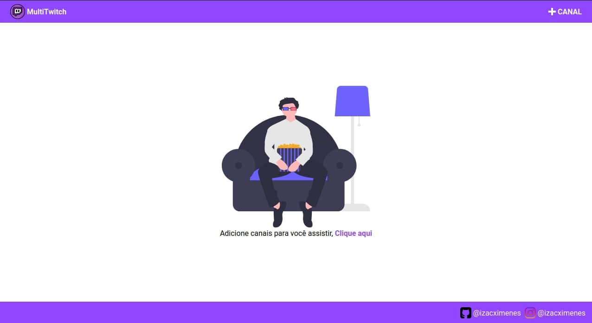

# multitwitch
Quando você precisa abrir varias abas do navegador para acompanhar vários streams ao mesmo tempo na twitch, agora você pode usar esse app e vai facilitar isso, com apenas uma aba você pode acompanhar vários streams ao mesmo tempo.



## Build Setup

```bash
# install dependencies
$ npm install

# serve with hot reload at localhost:3000
$ npm run dev

# build for production and launch server
$ npm run build
$ npm run start

# generate static project
$ npm run generate
```

For detailed explanation on how things work, check out [Nuxt.js docs](https://nuxtjs.org).
